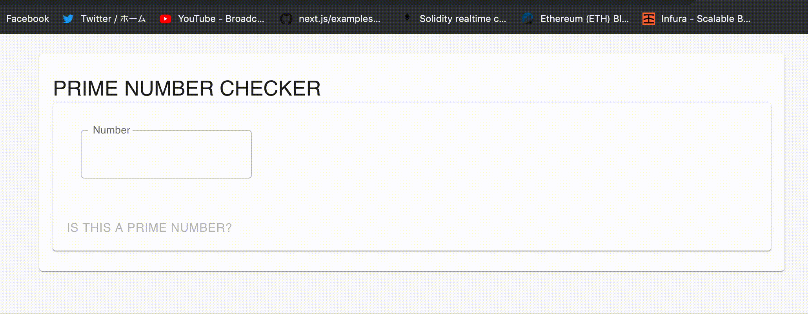

# Day6: React + Rust + WASM: prime-number-judger



An exercise to use WebAssembly on top of a React app.
I incorporated a simple logic judging whether the given number is a prime number into a materialUI-based react app.
```
pub fn is_prime(n: u64){
    let judgement = (2..(n as f64).sqrt() as u64 + 1).all(|i| n % i != 0);
    if judgement { 
        alert("This is a prime number! :)"); 
    } else { 
        alert("This is not a prime number."); 
    }
}
```