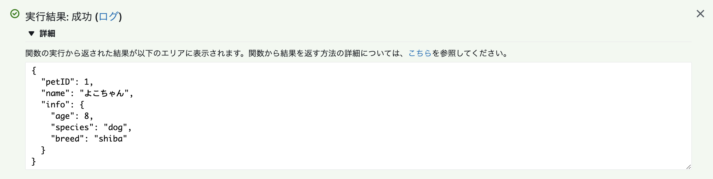

# Day7: Rust on AWS Lambda 

## Description
A simple Rust-based lambda function powered by serverless-framework.
This function retrieves an item from a DynamoDB table.
A test result below.

## Reference
- [serverless-rust plugin](https://github.com/softprops/serverless-rust)
- [rustoso](https://github.com/rusoto/rusoto)
- [Serverless FrameworkでAWS Lambdaファンクションをデプロイする（Rust版)](https://dev.classmethod.jp/cloud/aws/deploy-aws-lambda-rust-with-serverless-framework/)